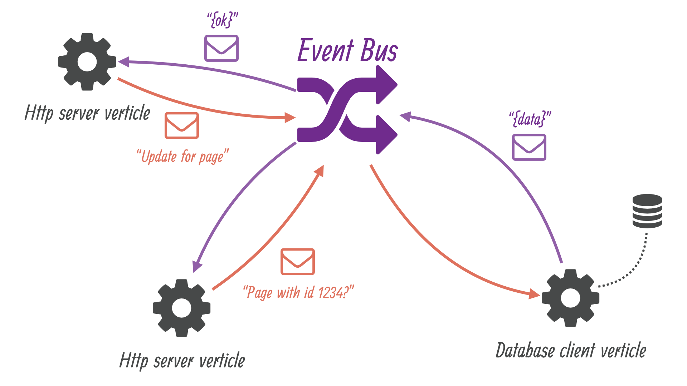

## 重构：独立可重用的 Verticle

> 提示：
>
> 相关的源代码可以在本手册（注：英文原版）的仓库 [step-2](https://github.com/vert-x3/vertx-guide-for-java-devs/tree/master/step-2) 目录下找到。

经过第一次迭代，我们得到了一个可以使用的 Wiki 应用。但它的实现之中仍有一些问题：

1. 处理 HTTP 请求的代码与访问数据库的代码交织在同一个方法之中
2. 许多配置数据（例如：端口号、JDBC 驱动等等）是以字符串的形式硬编码在代码之中

### 架构与技术选择

迭代的第二个版本设法重构代码，以实现 Verticle 的独立与可重用：



我们将部署 2 个 verticle 来分别处理 HTTP 请求与数据持久化。这 2 个 verticle 之间并不会直接互相引用，它们仅仅通过 event bus 中声明的名字及消息格式来通信。这是一种简单但有效的解耦。

在 event bus 上传递的消息采用 JSON 格式编码。尽管 Vert.x 对于要求高或非常特定的上下文，支持各种灵活的序列化方案，但通常意义上来说，JSON 是一个不错的选择。JSON 的另一个优点就是它是语言无关的文本格式。对于支持多语言的 Vert.x 来说，JSON 就是完美之选，其可以在不同语言编写的 verticle 之间传递消息。

### HTTP 服务器 verticle

Verticle 类前半部分和 ```start``` 方法如下所示：

```java
public class HttpServerVerticle extends AbstractVerticle {

  private static final Logger LOGGER = LoggerFactory.getLogger(HttpServerVerticle.class);

  public static final String CONFIG_HTTP_SERVER_PORT = "http.server.port";  // 注 1
  public static final String CONFIG_WIKIDB_QUEUE = "wikidb.queue";

  private String wikiDbQueue = "wikidb.queue";

  @Override
  public void start(Future<Void> startFuture) throws Exception {

    wikiDbQueue = config().getString(CONFIG_WIKIDB_QUEUE, "wikidb.queue");  // 注 2

    HttpServer server = vertx.createHttpServer();

    Router router = Router.router(vertx);
    router.get("/").handler(this::indexHandler);
    router.get("/wiki/:page").handler(this::pageRenderingHandler);
    router.post().handler(BodyHandler.create());
    router.post("/save").handler(this::pageUpdateHandler);
    router.post("/create").handler(this::pageCreateHandler);
    router.post("/delete").handler(this::pageDeletionHandler);

    int portNumber = config().getInteger(CONFIG_HTTP_SERVER_PORT, 8080);  // 注 3
    server
      .requestHandler(router::accept)
      .listen(portNumber, ar -> {
        if (ar.succeeded()) {
          LOGGER.info("HTTP server running on port " + portNumber);
          startFuture.complete();
        } else {
          LOGGER.error("Could not start a HTTP server", ar.cause());
          startFuture.fail(ar.cause());
        }
      });
  }

  // (...)
```

注：

1. 我们暴露以下 verticle 配置参数常量为 public：HTTP 端口和 event bus 中接收消息的终点名称（用于存储消息到数据库 verticle）。
2. ```AbstractVerticle#config()``` 方法允许访问已有的 verticle 配置。在没有配置的情况下，将使用第二个参数。
3. 配置值不只限于 ```String``` 类型，整形、布尔值、复杂的 JSON 数据等等都可以。

类中其他部分大多数是 HTTP 相关的代码，将之前数据库代码替换为 event bus 消息。下面是 ```indexHandler``` 方法：

```java
private final FreeMarkerTemplateEngine templateEngine = FreeMarkerTemplateEngine.create();

private void indexHandler(RoutingContext context) {

  DeliveryOptions options = new DeliveryOptions().addHeader("action", "all-pages"); // 注 2

  vertx.eventBus().send(wikiDbQueue, new JsonObject(), options, reply -> {  // 注 1
    if (reply.succeeded()) {
      JsonObject body = (JsonObject) reply.result().body();   // 注 3
      context.put("title", "Wiki home");
      context.put("pages", body.getJsonArray("pages").getList());
      templateEngine.render(context, "templates", "/index.ftl", ar -> {
        if (ar.succeeded()) {
          context.response().putHeader("Content-Type", "text/html");
          context.response().end(ar.result());
        } else {
          context.fail(ar.cause());
        }
      });
    } else {
      context.fail(reply.cause());
    }
  });
}
```

注：

1. 可以从 ```vertx``` 对象中取得 event bus，我们为数据库 verticle 向队列发送消息。
2. 传送选项（delivery option）允许我们指定 headers、payload codecs 和 timeouts。
3. 成功时，回应中包含 payload。

可以看到，一个 event bus 消息包含了 body、option 以及预期的回复。当预期没有回复时，可以使用没有 handler 的 ```send``` 方法。

我们将 payload 编码为 JSON 对象，通过名为 ```action``` 的消息 header 来指定数据库 verticle 应当执行哪一个操作（```action```）。

verticle 中剩下的代码里路由 handler 同样采用 event-bus 来获取、存储数据：

```java
private static final String EMPTY_PAGE_MARKDOWN =
"# A new page\n" +
  "\n" +
  "Feel-free to write in Markdown!\n";

private void pageRenderingHandler(RoutingContext context) {

  String requestedPage = context.request().getParam("page");
  JsonObject request = new JsonObject().put("page", requestedPage);

  DeliveryOptions options = new DeliveryOptions().addHeader("action", "get-page");
  vertx.eventBus().send(wikiDbQueue, request, options, reply -> {

    if (reply.succeeded()) {
      JsonObject body = (JsonObject) reply.result().body();

      boolean found = body.getBoolean("found");
      String rawContent = body.getString("rawContent", EMPTY_PAGE_MARKDOWN);
      context.put("title", requestedPage);
      context.put("id", body.getInteger("id", -1));
      context.put("newPage", found ? "no" : "yes");
      context.put("rawContent", rawContent);
      context.put("content", Processor.process(rawContent));
      context.put("timestamp", new Date().toString());

      templateEngine.render(context, "templates","/page.ftl", ar -> {
        if (ar.succeeded()) {
          context.response().putHeader("Content-Type", "text/html");
          context.response().end(ar.result());
        } else {
          context.fail(ar.cause());
        }
      });

    } else {
      context.fail(reply.cause());
    }
  });
}

private void pageUpdateHandler(RoutingContext context) {

  String title = context.request().getParam("title");
  JsonObject request = new JsonObject()
    .put("id", context.request().getParam("id"))
    .put("title", title)
    .put("markdown", context.request().getParam("markdown"));

  DeliveryOptions options = new DeliveryOptions();
  if ("yes".equals(context.request().getParam("newPage"))) {
    options.addHeader("action", "create-page");
  } else {
    options.addHeader("action", "save-page");
  }

  vertx.eventBus().send(wikiDbQueue, request, options, reply -> {
    if (reply.succeeded()) {
      context.response().setStatusCode(303);
      context.response().putHeader("Location", "/wiki/" + title);
      context.response().end();
    } else {
      context.fail(reply.cause());
    }
  });
}

private void pageCreateHandler(RoutingContext context) {
  String pageName = context.request().getParam("name");
  String location = "/wiki/" + pageName;
  if (pageName == null || pageName.isEmpty()) {
    location = "/";
  }
  context.response().setStatusCode(303);
  context.response().putHeader("Location", location);
  context.response().end();
}

private void pageDeletionHandler(RoutingContext context) {
  String id = context.request().getParam("id");
  JsonObject request = new JsonObject().put("id", id);
  DeliveryOptions options = new DeliveryOptions().addHeader("action", "delete-page");
  vertx.eventBus().send(wikiDbQueue, request, options, reply -> {
    if (reply.succeeded()) {
      context.response().setStatusCode(303);
      context.response().putHeader("Location", "/");
      context.response().end();
    } else {
      context.fail(reply.cause());
    }
  });
}
```

### 数据库 verticle

通过 JDBC 连接数据库自然需要用到 driver 及其配置，在之前的版本中，其被我们硬编码到代码之中。

#### 可配置的 SQL 查询

虽然 verticle 可以使用先前硬编码的值作为配置参数，但我们可以更进一步，从 properties 文件中加载 SQL 查询语句。

查询语句会从文件中加载来作为配置参数，当不存在时会从默认资源中取得。这种方法的优势在于可以适应不同的 JDBC driver 和 SQL 方言。

Verticle 类前半部分主要是配置键的定义：

```java
public class WikiDatabaseVerticle extends AbstractVerticle {

  public static final String CONFIG_WIKIDB_JDBC_URL = "wikidb.jdbc.url";
  public static final String CONFIG_WIKIDB_JDBC_DRIVER_CLASS = "wikidb.jdbc.driver_class";
  public static final String CONFIG_WIKIDB_JDBC_MAX_POOL_SIZE = "wikidb.jdbc.max_pool_size";
  public static final String CONFIG_WIKIDB_SQL_QUERIES_RESOURCE_FILE = "wikidb.sqlqueries.resource.file";

  public static final String CONFIG_WIKIDB_QUEUE = "wikidb.queue";

  private static final Logger LOGGER = LoggerFactory.getLogger(WikiDatabaseVerticle.class);

  // (...)
```

SQL 查询被存储在一个 properties 文件，对于 HSQLDB 默认情况下，存储于 ```src/main/resources/db-queries.properties```：
```
create-pages-table=create table if not exists Pages (Id integer identity primary key, Name varchar(255) unique, Content clob)
get-page=select Id, Content from Pages where Name = ?
create-page=insert into Pages values (NULL, ?, ?)
save-page=update Pages set Content = ? where Id = ?
all-pages=select Name from Pages
delete-page=delete from Pages where Id = ?
```

下面是 ```WikiDatabaseVerticle``` 类从文件中加载 SQL 查询，并存入一个 map 的代码：

```java
private enum SqlQuery {
  CREATE_PAGES_TABLE,
  ALL_PAGES,
  GET_PAGE,
  CREATE_PAGE,
  SAVE_PAGE,
  DELETE_PAGE
}

private final HashMap<SqlQuery, String> sqlQueries = new HashMap<>();

private void loadSqlQueries() throws IOException {

  String queriesFile = config().getString(CONFIG_WIKIDB_SQL_QUERIES_RESOURCE_FILE);
  InputStream queriesInputStream;
  if (queriesFile != null) {
    queriesInputStream = new FileInputStream(queriesFile);
  } else {
    queriesInputStream = getClass().getResourceAsStream("/db-queries.properties");
  }

  Properties queriesProps = new Properties();
  queriesProps.load(queriesInputStream);
  queriesInputStream.close();

  sqlQueries.put(SqlQuery.CREATE_PAGES_TABLE, queriesProps.getProperty("create-pages-table"));
  sqlQueries.put(SqlQuery.ALL_PAGES, queriesProps.getProperty("all-pages"));
  sqlQueries.put(SqlQuery.GET_PAGE, queriesProps.getProperty("get-page"));
  sqlQueries.put(SqlQuery.CREATE_PAGE, queriesProps.getProperty("create-page"));
  sqlQueries.put(SqlQuery.SAVE_PAGE, queriesProps.getProperty("save-page"));
  sqlQueries.put(SqlQuery.DELETE_PAGE, queriesProps.getProperty("delete-page"));
}
```

我们使用 ```SqlQuery``` 枚举类型来避免之后在代码中使用字符串常量。此 verticle 的 ```start``` 方法如下所示：

```java
private JDBCClient dbClient;

@Override
public void start(Future<Void> startFuture) throws Exception {

  /*
   * Note: this uses blocking APIs, but data is small...
   */
  loadSqlQueries();  // 注 1

  dbClient = JDBCClient.createShared(vertx, new JsonObject()
    .put("url", config().getString(CONFIG_WIKIDB_JDBC_URL, "jdbc:hsqldb:file:db/wiki"))
    .put("driver_class", config().getString(CONFIG_WIKIDB_JDBC_DRIVER_CLASS, "org.hsqldb.jdbcDriver"))
    .put("max_pool_size", config().getInteger(CONFIG_WIKIDB_JDBC_MAX_POOL_SIZE, 30)));

  dbClient.getConnection(ar -> {
    if (ar.failed()) {
      LOGGER.error("Could not open a database connection", ar.cause());
      startFuture.fail(ar.cause());
    } else {
      SQLConnection connection = ar.result();
      connection.execute(sqlQueries.get(SqlQuery.CREATE_PAGES_TABLE), create -> {   // 注 2
        connection.close();
        if (create.failed()) {
          LOGGER.error("Database preparation error", create.cause());
          startFuture.fail(create.cause());
        } else {
          vertx.eventBus().consumer(config().getString(CONFIG_WIKIDB_QUEUE, "wikidb.queue"), this::onMessage);  // 注 3
          startFuture.complete();
        }
      });
    }
  });
}
```

注：

1. 有趣的是我们打破了 Vert.x 中非常重要的一个原则 —— 避免阻塞式 API，但访问 classpath 的资源并没有异步式的接口，因此我们选择非常有限。我们可以使用 Vert.x ```executeBlocking``` 方法来将阻塞式 I/O 操作从 event loop 中拆解到其他线程（a worker thread），但因为数据非常小，这样做并不会有明显的好处。
2. 这是一个使用 SQL 语句的例子。
3. ```consumer``` 方法注册一个 event bus 终点 handler。（The ```consumer``` method registers an event bus destination handler.）

#### 分发请求

event bus 消息的 handler 就是 ```onMessage``` 方法：

```java
public enum ErrorCodes {
  NO_ACTION_SPECIFIED,
  BAD_ACTION,
  DB_ERROR
}

public void onMessage(Message<JsonObject> message) {

  if (!message.headers().contains("action")) {
    LOGGER.error("No action header specified for message with headers {} and body {}",
      message.headers(), message.body().encodePrettily());
    message.fail(ErrorCodes.NO_ACTION_SPECIFIED.ordinal(), "No action header specified");
    return;
  }
  String action = message.headers().get("action");

  switch (action) {
    case "all-pages":
      fetchAllPages(message);
      break;
    case "get-page":
      fetchPage(message);
      break;
    case "create-page":
      createPage(message);
      break;
    case "save-page":
      savePage(message);
      break;
    case "delete-page":
      deletePage(message);
      break;
    default:
      message.fail(ErrorCodes.BAD_ACTION.ordinal(), "Bad action: " + action);
  }
}
```

我们为各种错误定义了一个 ```ErrorCodes``` 枚举，其可以被用来报告错误给消息发送者。```Message``` 类的 ```fail``` 方法
提供了一个快捷方便得回复错误的方式，原始的消息发送者会得到一个失败的 ```AsyncResult```。

#### 减少 JDBC 客户端构建代码

到目前为止，可以看到执行 SQL 查询的完整交互：

1. 取得连接
2. 执行请求
3. 释放连接

就像下面的代码一样，这会导致每个异步操作，都需要大量的错误处理代码：

```java
dbClient.getConnection(car -> {
  if (car.succeeded()) {
    SQLConnection connection = car.result();
    connection.query(sqlQueries.get(SqlQuery.ALL_PAGES), res -> {
      connection.close();
      if (res.succeeded()) {
        List<String> pages = res.result()
          .getResults()
          .stream()
          .map(json -> json.getString(0))
          .sorted()
          .collect(Collectors.toList());
        message.reply(new JsonObject().put("pages", new JsonArray(pages)));
      } else {
        reportQueryError(message, res.cause());
      }
    });
  } else {
    reportQueryError(message, car.cause());
  }
});
```

从 Vert.x 3.5.0 开始，JDBC 连接开始支持一步到位的操作，其可以提供一个连接来执行 SQL 操作，然后自己释放掉。与上面代码功能一致，精简过后的代码如下所示：

```java
dbClient.query(sqlQueries.get(SqlQuery.ALL_PAGES), res -> {
  if (res.succeeded()) {
    List<String> pages = res.result()
      .getResults()
      .stream()
      .map(json -> json.getString(0))
      .sorted()
      .collect(Collectors.toList());
    message.reply(new JsonObject().put("pages", new JsonArray(pages)));
  } else {
    reportQueryError(message, res.cause());
  }
});
```

这对于需要取得连接，只执行一个操作的场景非常有用。当然对于一连串的 SQL 操作来说，重复使用一个连接会使得性能更好。

类中剩下的代码包含 ```onMessage``` 分发传入的消息后需要被调用的私有方法：

```java
private void fetchAllPages(Message<JsonObject> message) {
  dbClient.query(sqlQueries.get(SqlQuery.ALL_PAGES), res -> {
    if (res.succeeded()) {
      List<String> pages = res.result()
        .getResults()
        .stream()
        .map(json -> json.getString(0))
        .sorted()
        .collect(Collectors.toList());
      message.reply(new JsonObject().put("pages", new JsonArray(pages)));
    } else {
      reportQueryError(message, res.cause());
    }
  });
}

private void fetchPage(Message<JsonObject> message) {
  String requestedPage = message.body().getString("page");
  JsonArray params = new JsonArray().add(requestedPage);

  dbClient.queryWithParams(sqlQueries.get(SqlQuery.GET_PAGE), params, fetch -> {
    if (fetch.succeeded()) {
      JsonObject response = new JsonObject();
      ResultSet resultSet = fetch.result();
      if (resultSet.getNumRows() == 0) {
        response.put("found", false);
      } else {
        response.put("found", true);
        JsonArray row = resultSet.getResults().get(0);
        response.put("id", row.getInteger(0));
        response.put("rawContent", row.getString(1));
      }
      message.reply(response);
    } else {
      reportQueryError(message, fetch.cause());
    }
  });
}

private void createPage(Message<JsonObject> message) {
  JsonObject request = message.body();
  JsonArray data = new JsonArray()
    .add(request.getString("title"))
    .add(request.getString("markdown"));

  dbClient.updateWithParams(sqlQueries.get(SqlQuery.CREATE_PAGE), data, res -> {
    if (res.succeeded()) {
      message.reply("ok");
    } else {
      reportQueryError(message, res.cause());
    }
  });
}

private void savePage(Message<JsonObject> message) {
  JsonObject request = message.body();
  JsonArray data = new JsonArray()
    .add(request.getString("markdown"))
    .add(request.getString("id"));

  dbClient.updateWithParams(sqlQueries.get(SqlQuery.SAVE_PAGE), data, res -> {
    if (res.succeeded()) {
      message.reply("ok");
    } else {
      reportQueryError(message, res.cause());
    }
  });
}

private void deletePage(Message<JsonObject> message) {
  JsonArray data = new JsonArray().add(message.body().getString("id"));

  dbClient.updateWithParams(sqlQueries.get(SqlQuery.DELETE_PAGE), data, res -> {
    if (res.succeeded()) {
      message.reply("ok");
    } else {
      reportQueryError(message, res.cause());
    }
  });
}

private void reportQueryError(Message<JsonObject> message, Throwable cause) {
  LOGGER.error("Database query error", cause);
  message.fail(ErrorCodes.DB_ERROR.ordinal(), cause.getMessage());
}
```

### 在 main verticle 中部署 verticles

我们仍然有 ```MainVerticle``` 类，但不同于第一版包含所有业务逻辑代码，它的作用只是启动应用，部署其他verticle。

下面的代码部署了一个 ```WikiDatabaseVerticle``` 实例，两个 ```HttpServerVerticle``` 实例：

```java
public class MainVerticle extends AbstractVerticle {

  @Override
  public void start(Future<Void> startFuture) throws Exception {

    Future<String> dbVerticleDeployment = Future.future();  // 注 1
    vertx.deployVerticle(new WikiDatabaseVerticle(), dbVerticleDeployment.completer());  // 注 2

    dbVerticleDeployment.compose(id -> {  // 注 3

      Future<String> httpVerticleDeployment = Future.future();
      vertx.deployVerticle(
        "io.vertx.guides.wiki.HttpServerVerticle",  // 注 4
        new DeploymentOptions().setInstances(2),    // 注 5
        httpVerticleDeployment.completer());

      return httpVerticleDeployment;  // 注 6

    }).setHandler(ar -> {   // 注 7
      if (ar.succeeded()) {
        startFuture.complete();
      } else {
        startFuture.fail(ar.cause());
      }
    });
  }
}
```

注：

1. 部署一个 verticle 是异步操作，所以我们需要一个 ```Future```。参数类型是 ```String``` 的原因是在成功部署之后，会得到一个 verticle 的标识符。
2. 部署的一种方式是使用 ```new``` 来创建一个 verticle 实例，然后将其对象引用传递给 ```deploy``` 方法。```completer``` 返回的值是一个 handler，其用来简单的完成这个 future。
3. 使用 ```compose``` 按顺序的组合可以实现在其后执行异步操作。当前面的 future 成功完成，组合函数就被激活。
4. 可以通过类名作为字符串来指定一个 verticle 来部署。对于其他 JVM 语言来说，基于字符串的允许一个 module / script 被指定。
5. ```DeploymentOption``` 类允许指定部署的实例个数。
6. 组合函数返回下一个 future。它的完成将触发组合操作的完成。
7. 我们定义了一个 handler 来最终完成 ```MainVerticle``` start future。

聪明的你可能会奇怪为什么 HTTP server 可以被部署到同一个 TCP 端口两次，而不会出现因为端口占用的错误。因为对于大多数的 web 框架来说，我们需要选择不同的 TCP 端口，并且需要一个前置的 HTTP 代理来实现端口间的负载均衡。

而 Vert.x 的 verticle 可以实现多个 verticle 共享一个 TCP 端口。来自接收线程（accepting threads）传入的网络连接会简单得基于轮询模式分配。
