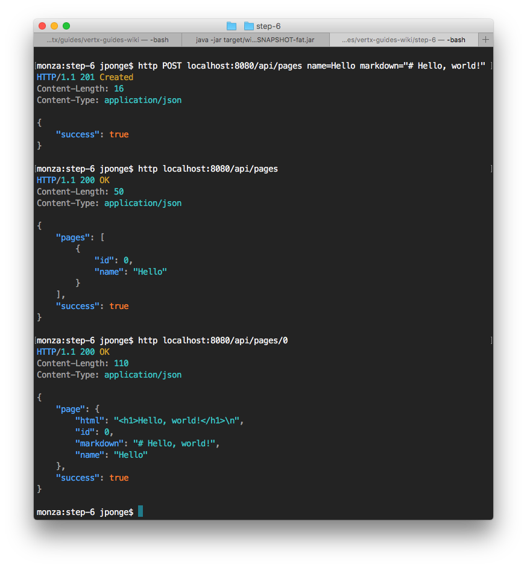

## 实现 web API

> 提示：
>
> 相关的源代码可以在本手册（注：英文原版）的仓库 [step-6](https://github.com/vert-x3/vertx-guide-for-java-devs/tree/master/step-6) 目录下找到。

通过我们已经使用过的 `vertx-web` 模块，非常容易地就可以实现 HTTP/JSON 形式的 web API。我们接下来会使用如下 URL 来暴露我们的 web API：

* `GET /api/pages` 提供所有页面名字及 ID 的描述
* `POST /api/pages` 根据请求创建一个新的 wiki 页面
* `PUT /api/pages/:id` 根据请求更新一个 wiki 页面
* `DELETE /api/pages/:id` 删除一个 wiki 页面

下面是使用 [HTTPie](https://httpie.org/)（一个命令行工具）与我们的 API 交互的截图：



### Web 子路由

我们将向 `HttpServerVerticle` 添加一些新的路由hanlder。虽然我们可以直接向已经存在的 router 之中添加，但更好的方式是使用子路由（sub-routers）。一个路由可以作为子路由，挂载到另外一个上面，这有利于组织或重利用 handler。

以下是 API 路由的代码：

```java
Router apiRouter = Router.router(vertx);
apiRouter.get("/pages").handler(this::apiRoot);
apiRouter.get("/pages/:id").handler(this::apiGetPage);
apiRouter.post().handler(BodyHandler.create());
apiRouter.post("/pages").handler(this::apiCreatePage);
apiRouter.put().handler(BodyHandler.create());
apiRouter.put("/pages/:id").handler(this::apiUpdatePage);
apiRouter.delete("/pages/:id").handler(this::apiDeletePage);
router.mountSubRouter("/api", apiRouter); // (1)
```

* 注：

1. 我们在此处挂载我们的路由，因此所有以 `/api` 为路径的请求都会被定向到 `apiRouter` 之中。

### Handlers

以下是不同 API 的路由hanlder 的代码。

#### 根资源

```java
private void apiRoot(RoutingContext context) {
  dbService.fetchAllPagesData(reply -> {
    JsonObject response = new JsonObject();
    if (reply.succeeded()) {
      List<JsonObject> pages = reply.result()
        .stream()
        .map(obj -> new JsonObject()
          .put("id", obj.getInteger("ID")) // (1)
          .put("name", obj.getString("NAME")))
        .collect(Collectors.toList());
      response
        .put("success", true)
        .put("pages", pages); // (2)
      context.response().setStatusCode(200);
      context.response().putHeader("Content-Type", "application/json");
      context.response().end(response.encode()); // (3)
    } else {
      response
        .put("success", false)
        .put("error", reply.cause().getMessage());
      context.response().setStatusCode(500);
      context.response().putHeader("Content-Type", "application/json");
      context.response().end(response.encode());
    }
  });
}
```

* 注：

1. 此处只是简单的将数据库查询结果中的信息记录对象重新映射。
2. 填充返回的 payload 中的 `pages` 的值。
3. `JsonObject#encode()` 方法提供 JSON 数据紧凑的（译者注：无换行等）`String` 形式数据。

#### 获取一个页面

```java
private void apiGetPage(RoutingContext context) {
  int id = Integer.valueOf(context.request().getParam("id"));
  dbService.fetchPageById(id, reply -> {
    JsonObject response = new JsonObject();
    if (reply.succeeded()) {
      JsonObject dbObject = reply.result();
      if (dbObject.getBoolean("found")) {
        JsonObject payload = new JsonObject()
          .put("name", dbObject.getString("name"))
          .put("id", dbObject.getInteger("id"))
          .put("markdown", dbObject.getString("content"))
          .put("html", Processor.process(dbObject.getString("content")));
        response
          .put("success", true)
          .put("page", payload);
        context.response().setStatusCode(200);
      } else {
        context.response().setStatusCode(404);
        response
          .put("success", false)
          .put("error", "There is no page with ID " + id);
      }
    } else {
      response
        .put("success", false)
        .put("error", reply.cause().getMessage());
      context.response().setStatusCode(500);
    }
    context.response().putHeader("Content-Type", "application/json");
    context.response().end(response.encode());
  });
}
```

#### 创建一个页面

```java
private void apiCreatePage(RoutingContext context) {
  JsonObject page = context.getBodyAsJson();
  if (!validateJsonPageDocument(context, page, "name", "markdown")) {
    return;
  }
  dbService.createPage(page.getString("name"), page.getString("markdown"), reply -> {
    if (reply.succeeded()) {
      context.response().setStatusCode(201);
      context.response().putHeader("Content-Type", "application/json");
      context.response().end(new JsonObject().put("success", true).encode());
    } else {
      context.response().setStatusCode(500);
      context.response().putHeader("Content-Type", "application/json");
      context.response().end(new JsonObject()
        .put("success", false)
        .put("error", reply.cause().getMessage()).encode());
    }
  });
}
```

此 handler 需要处理传入的 JSON 数据。使用 `validateJsonPageDocument` 方法可以校验数据，并尽早的报告出错误，这样后面的处理就可以假定所需的数据记录是存在的：

```java
private boolean validateJsonPageDocument(RoutingContext context, JsonObject page, String... expectedKeys) {
  if (!Arrays.stream(expectedKeys).allMatch(page::containsKey)) {
    LOGGER.error("Bad page creation JSON payload: " + page.encodePrettily() + " from " + context.request().remoteAddress());
    context.response().setStatusCode(400);
    context.response().putHeader("Content-Type", "application/json");
    context.response().end(new JsonObject()
      .put("success", false)
      .put("error", "Bad request payload").encode());
    return false;
  }
  return true;
}
```

#### 更新一个页面

```java
private void apiUpdatePage(RoutingContext context) {
  int id = Integer.valueOf(context.request().getParam("id"));
  JsonObject page = context.getBodyAsJson();
  if (!validateJsonPageDocument(context, page, "markdown")) {
    return;
  }
  dbService.savePage(id, page.getString("markdown"), reply -> {
    handleSimpleDbReply(context, reply);
  });
}
```

`handleSimpleDbReply` 方法是为了处理请求的一个帮助方法：

```java
private void handleSimpleDbReply(RoutingContext context, AsyncResult<Void> reply) {
  if (reply.succeeded()) {
    context.response().setStatusCode(200);
    context.response().putHeader("Content-Type", "application/json");
    context.response().end(new JsonObject().put("success", true).encode());
  } else {
    context.response().setStatusCode(500);
    context.response().putHeader("Content-Type", "application/json");
    context.response().end(new JsonObject()
      .put("success", false)
      .put("error", reply.cause().getMessage()).encode());
  }
}
```

#### 删除一个页面

```java
private void apiDeletePage(RoutingContext context) {
  int id = Integer.valueOf(context.request().getParam("id"));
  dbService.deletePage(id, reply -> {
    handleSimpleDbReply(context, reply);
  });
}
```

### 对 API 进行单元测试

我们在 `io.vertx.guides.wiki.http.ApiTest` 类中编写了一个基本的测试用例。

我们首先要准备好测试环境。HTTP服务器verticle需要数据库verticle，因此我们将他们一起部署到我们的测试Vert.x上下文中。

```java
@RunWith(VertxUnitRunner.class)
public class ApiTest {

  private Vertx vertx;
  private WebClient webClient;

  @Before
  public void prepare(TestContext context) {
    vertx = Vertx.vertx();

    JsonObject dbConf = new JsonObject()
      .put(WikiDatabaseVerticle.CONFIG_WIKIDB_JDBC_URL, "jdbc:hsqldb:mem:testdb;shutdown=true") // (1)
      .put(WikiDatabaseVerticle.CONFIG_WIKIDB_JDBC_MAX_POOL_SIZE, 4);

    vertx.deployVerticle(new WikiDatabaseVerticle(),
      new DeploymentOptions().setConfig(dbConf), context.asyncAssertSuccess());

    vertx.deployVerticle(new HttpServerVerticle(), context.asyncAssertSuccess());

    webClient = WebClient.create(vertx, new WebClientOptions()
      .setDefaultHost("localhost")
      .setDefaultPort(8080));
  }

  @After
  public void finish(TestContext context) {
    vertx.close(context.asyncAssertSuccess());
  }

  // (...)
```

* 注：

1. 对于测试，我们使用一个不同的 JDBC URL，将数据存储在一个内存数据库中。

一个完整的测试用例就是一个所有类型请求都会执行的场景。此处，它创建页面，获取它，更新然后删除它：

```java
@Test
public void play_with_api(TestContext context) {
  Async async = context.async();

  JsonObject page = new JsonObject()
    .put("name", "Sample")
    .put("markdown", "# A page");

  Future<JsonObject> postRequest = Future.future();
  webClient.post("/api/pages")
    .as(BodyCodec.jsonObject())
    .sendJsonObject(page, ar -> {
      if (ar.succeeded()) {
        HttpResponse<JsonObject> postResponse = ar.result();
        postRequest.complete(postResponse.body());
      } else {
        context.fail(ar.cause());
      }
    });

  Future<JsonObject> getRequest = Future.future();
  postRequest.compose(h -> {
    webClient.get("/api/pages")
      .as(BodyCodec.jsonObject())
      .send(ar -> {
        if (ar.succeeded()) {
          HttpResponse<JsonObject> getResponse = ar.result();
          getRequest.complete(getResponse.body());
        } else {
          context.fail(ar.cause());
        }
      });
  }, getRequest);

  Future<JsonObject> putRequest = Future.future();
  getRequest.compose(response -> {
    JsonArray array = response.getJsonArray("pages");
    context.assertEquals(1, array.size());
    context.assertEquals(0, array.getJsonObject(0).getInteger("id"));
    webClient.put("/api/pages/0")
      .as(BodyCodec.jsonObject())
      .sendJsonObject(new JsonObject()
        .put("id", 0)
        .put("markdown", "Oh Yeah!"), ar -> {
        if (ar.succeeded()) {
          HttpResponse<JsonObject> putResponse = ar.result();
          putRequest.complete(putResponse.body());
        } else {
          context.fail(ar.cause());
        }
      });
  }, putRequest);

  Future<JsonObject> deleteRequest = Future.future();
  putRequest.compose(response -> {
    context.assertTrue(response.getBoolean("success"));
    webClient.delete("/api/pages/0")
      .as(BodyCodec.jsonObject())
      .send(ar -> {
        if (ar.succeeded()) {
          HttpResponse<JsonObject> delResponse = ar.result();
          deleteRequest.complete(delResponse.body());
        } else {
          context.fail(ar.cause());
        }
      });
  }, deleteRequest);

  deleteRequest.compose(response -> {
    context.assertTrue(response.getBoolean("success"));
    async.complete();
  }, Future.failedFuture("Oh?"));
}
```

> 提示：
>
> 测试之中使用了 `Future` 对象，而不是嵌套的回调；最后一个部分必须将 `async` 标记为完成，否则的话测试最终只能超时结束。
