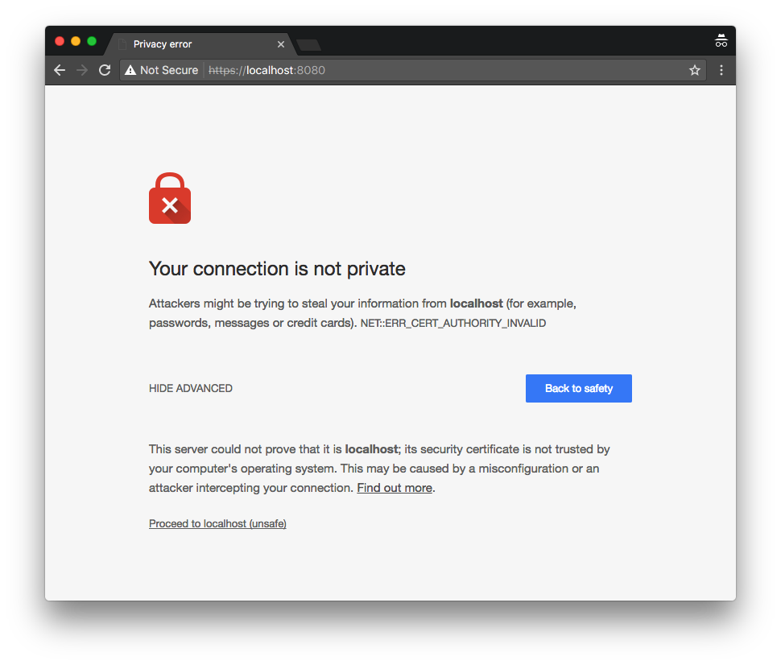

## 安全保证及访问控制

> 提示：
>
> 相关的源代码可以在本手册（注：英文原版）的仓库 [step-7](https://github.com/vert-x3/vertx-guide-for-java-devs/tree/master/step-7) 目录下找到。

使用 Vert.x，很容易就可以实现安全保证及访问控制。在本小节中，我们将会：

1. 使用 HTTPS 代替 HTTP
2. 对 Web 应用增加基于组权限的用户认证
3. 使用 [JSON web tokens (JWT)](https://jwt.io/) 控制对 web API 的访问。

### Vert.x 中使用 HTTPS

Vert.x 提供了 SSL-加密 网络连接的支持。在生产环境中，将服务通过 HTTP 协议暴露给像是 Nginx 这样的前置代理服务器，再由其使用 HTTPS 协议与客户端连接的做法很常见。虽然如此，但 Vert.x 也可以自身使用 HTTPS 协议来提供服务端与客户端之间的加密。

证书可以使用 Java KeyStore 文件的形式。可以自己签发一个证书来进行测试，以下命令可以创建一个名为 `server-keystore.jks` 的 KeyStore 文件，其密码为 `secret`。

```bash
keytool -genkey \
  -alias test \
  -keyalg RSA \
  -keystore server-keystore.jks \
  -keysize 2048 \
  -validity 360 \
  -dname CN=localhost \
  -keypass secret \
  -storepass secret
```

我们可以在 HTTP 服务器创建时，传入一个 `HttpServerOptions` 对象来指明使用 SSL，并指出 KeyStore 文件位置。

```java
HttpServer server = vertx.createHttpServer(new HttpServerOptions()
  .setSsl(true)
  .setKeyStoreOptions(new JksOptions()
    .setPath("server-keystore.jks")
    .setPassword("secret")));
```

我们可以用浏览器访问 https://localhost:8080/ ，但证书是自签发的，因此正常的浏览器都会给与安全警告来阻止访问：



最后但也值得注意的是，因为 `ApiTest` 中的 Web 客户端只是处理 HTTP 请求，所以我们也需要更新测试用例代码：

```java
webClient = WebClient.create(vertx, new WebClientOptions()
  .setDefaultHost("localhost")
  .setDefaultPort(8080)
  .setSsl(true) // (1)
  .setTrustOptions(new JksOptions().setPath("server-keystore.jks").setPassword("secret"))); // (2)
```

1. 确保使用 SSL。
2. 因为证书是自签发的，所以我们需要明确指出信任该证书，否则连接就会像浏览器那样失败。